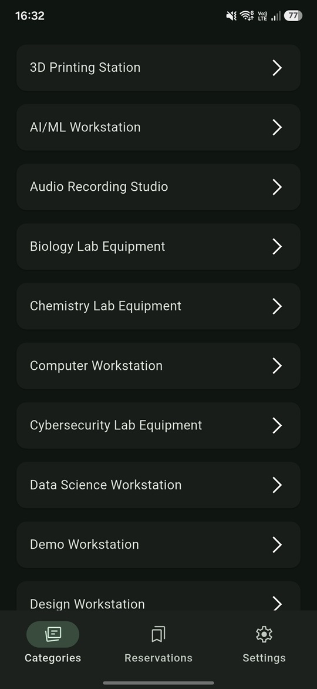
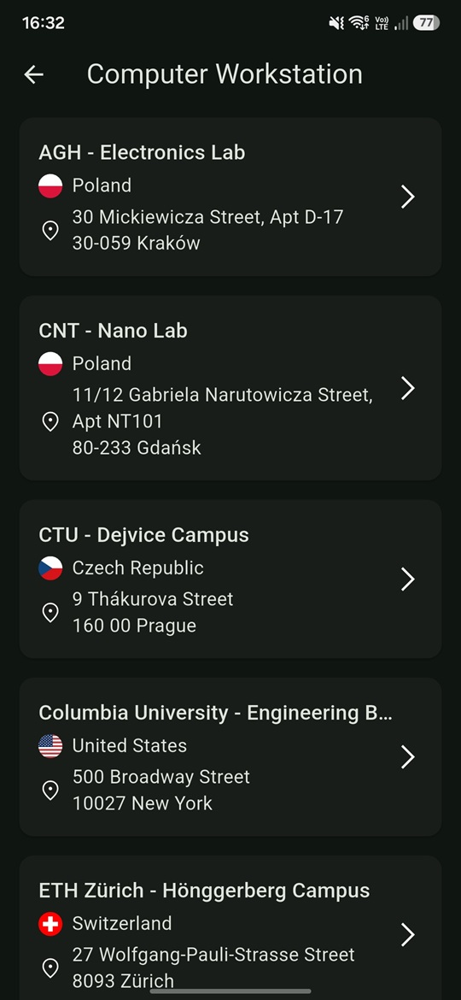
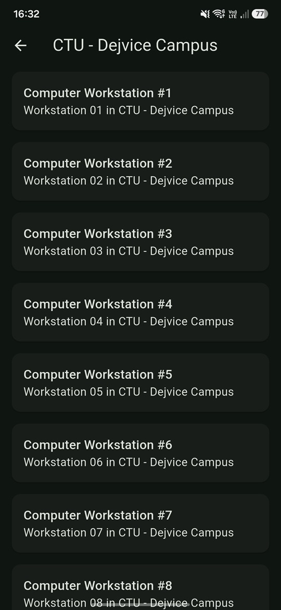
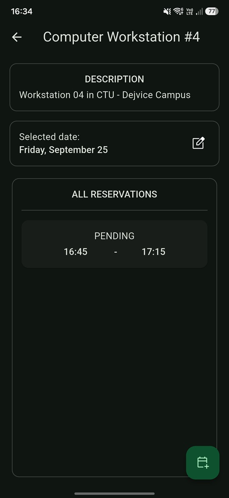
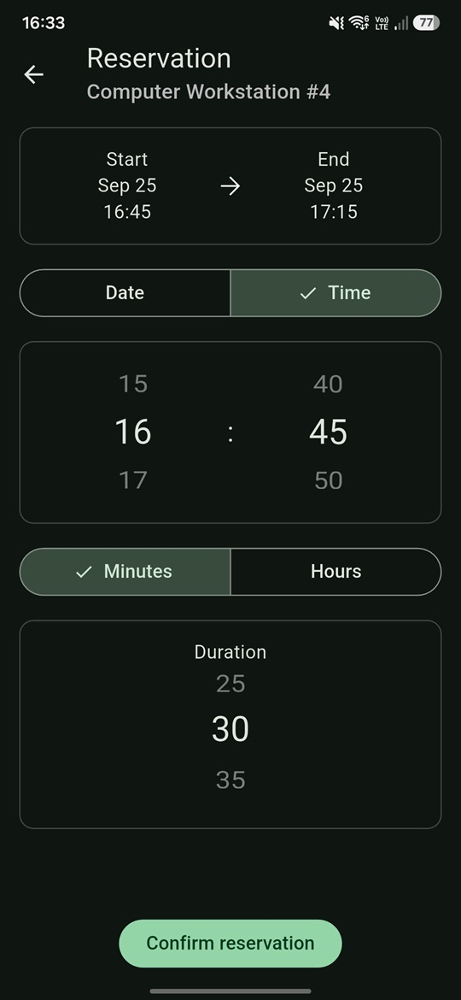
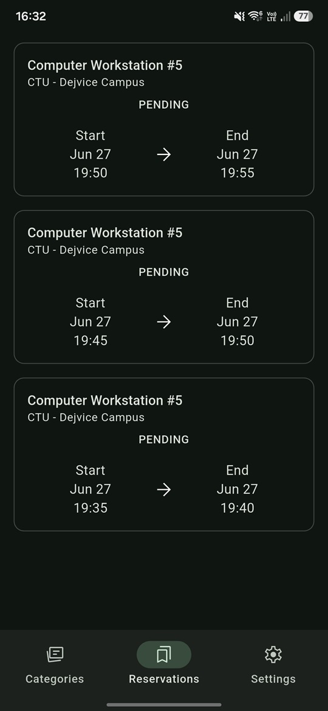
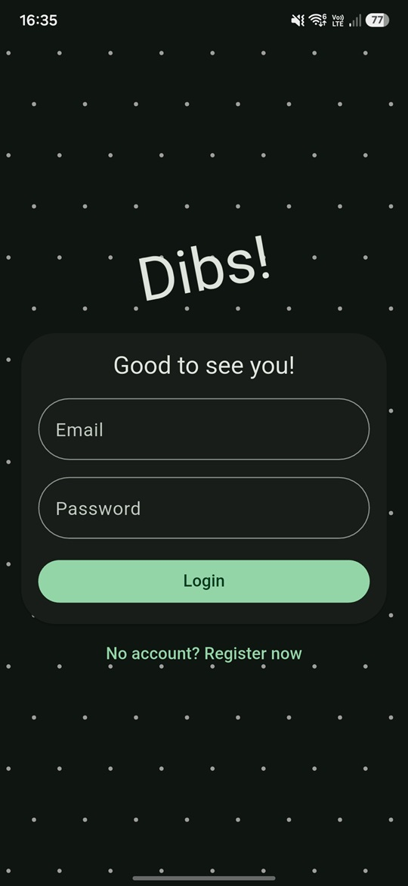
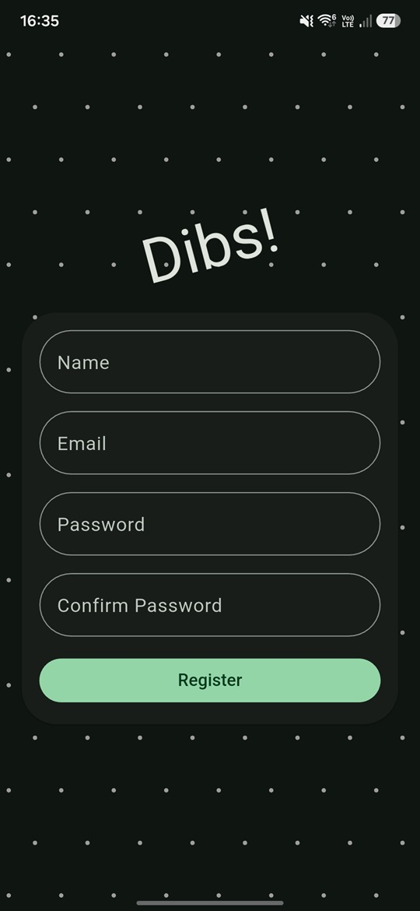

# Dibs!

An Android app for finding and reserving workstations. Browse locations by category, look into a location's available workstations, and book one for a specific date, time and duration. The app warns you before you double-book a slot that's already taken.

Backend: https://github.com/mmorawski520/dibs

*Android only. Built with Flutter.*

## Screenshots

|                      Categories                       |                       Locations                       |                       Workstations                       |
|:-----------------------------------------------------:|:-----------------------------------------------------:|:--------------------------------------------------------:|
|  |  |  |

|                     Workstation Details                     |                   New Reservation                   |                     Reservations                     |
|:-----------------------------------------------------------:|:---------------------------------------------------:|:----------------------------------------------------:|
|  |  |  |


|                     Login                     |                     Register                     |
|:---------------------------------------------:|:------------------------------------------------:|
|  |  |

## Browsing

- Categories → Locations → Items, each level paginated with infinite scroll
- Locations show country flag and address; items show name, description and availability
- An item's detail page lists its upcoming reservations for the selected date

## Reservations

- Pick a date, a start time and a duration (in minutes or hours) to create a reservation
- Conflicting bookings for the same item are flagged before you can confirm
- A dedicated list shows all of your own reservations, newest first

## Account

- Email/password login and registration
- Settings screen with your info, logout (with confirmation) and an About dialog

## Running it

Requires Flutter 3.41.9 (Dart SDK ^3.11.5)

```bash
flutter pub get
flutter run
```